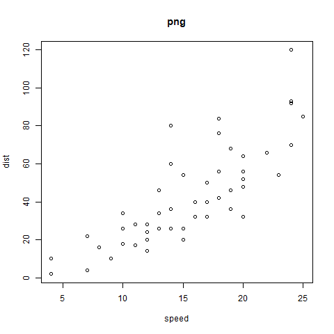

# Test {#test .unnumbered}
\markboth{test}{}


```{r gb, fig.cap='bla', echo = FALSE}

```
```{r logo, out.width='32.8%', fig.show='hold', bicap=c('上海交通大学','SJTU'), fig.align="center"}

```


```{r si, eval=FALSE}
bookdown::preview_chapter("00-preface.Rmd", 
  output_format="bookdown::gitbook", encoding="UTF-8")
```


\cleardoublepage

